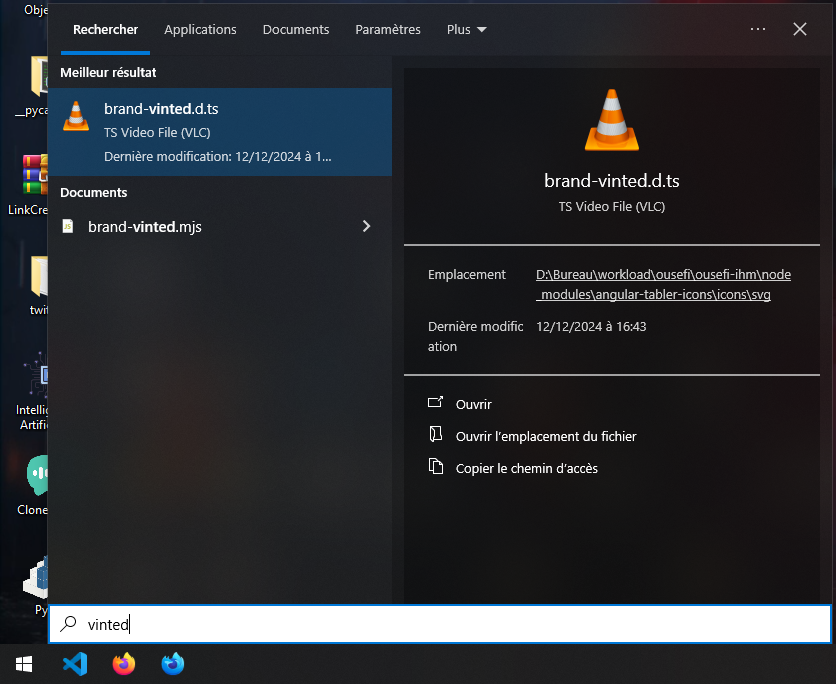
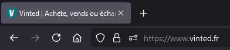
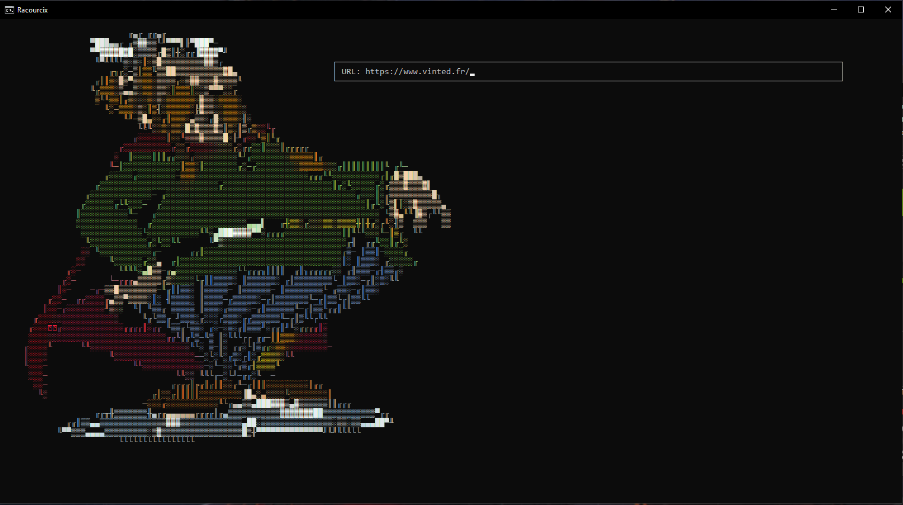
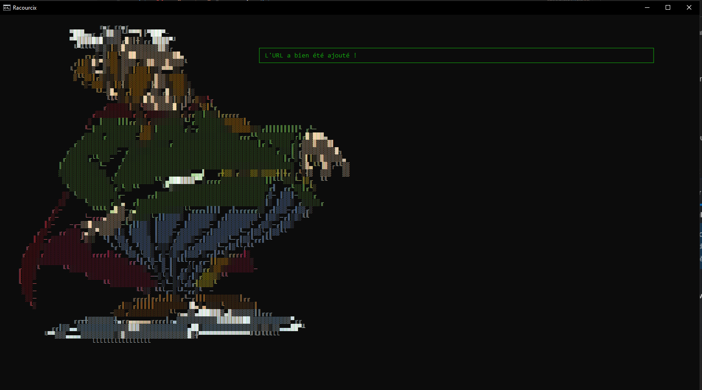
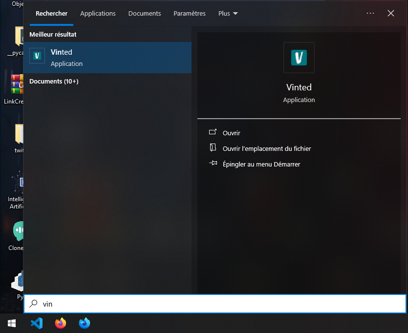

    

<h1 align="center">Racourcix</h1>

Application permettant de créer un raccourci vers un lien internet dans le menu démarrer de Windows.

 

## 🚀 Installation

Une fois le projet cloné et placé dans l'emplacement souhaité, exécutez le script Python `Initialisation.py` pour créer les dossiers nécessaires au bon fonctionnement de l'application.

## 🛠️ Utilisation

Prenons un exemple : nous souhaitons que lorsqu'on tape `vinted` dans la barre de recherche du menu démarrer, cela redirige directement vers le site **vinted.fr**.

### Étape 1 : Vérification initiale

Actuellement, lorsque nous tapons `vinted`, le site n’apparaît pas dans la recherche.  
Voici l'exemple d'une recherche infructueuse :

### Étape 2 : Récupération de l'adresse exacte

Pour que le raccourci fonctionne correctement, récupérez l’adresse exacte de **Vinted**, soit : `https://www.vinted.fr/`

Pour vous assurer que l'URL est correcte, tapez-la directement dans un navigateur web. Ce dernier corrigera automatiquement les éventuelles erreurs :

### Étape 3 : Ajout du raccourci via Racourcix

1. Lancez **Racourcix** :
   - Vous pouvez soit double-cliquer sur le fichier Python `Racourcix.py`, soit le lancer via un terminal.

2. Une fois Racourcix ouvert, entrez l’adresse exacte (dans notre cas : `https://www.vinted.fr/`) dans le champ prévu à cet effet.  

3. Appuyez sur la touche **Entrée** et attendez que le logiciel vous confirme l’ajout de l’URL.  
   Exemple de confirmation :  

### Étape 4 : Vérification du raccourci

Recherchez ensuite le nom du site (ici `vinted`) dans la barre de recherche du menu démarrer Windows. Vous devriez maintenant voir le raccourci ajouté avec succès :

🎉 Félicitations ! Vous venez de créer votre premier raccourci avec **Racourcix** !  

*En cas de problème ou de question, n’hésitez pas à ouvrir une **issue** dans le dépôt du projet. Je ferai de mon mieux pour vous répondre rapidement.*
